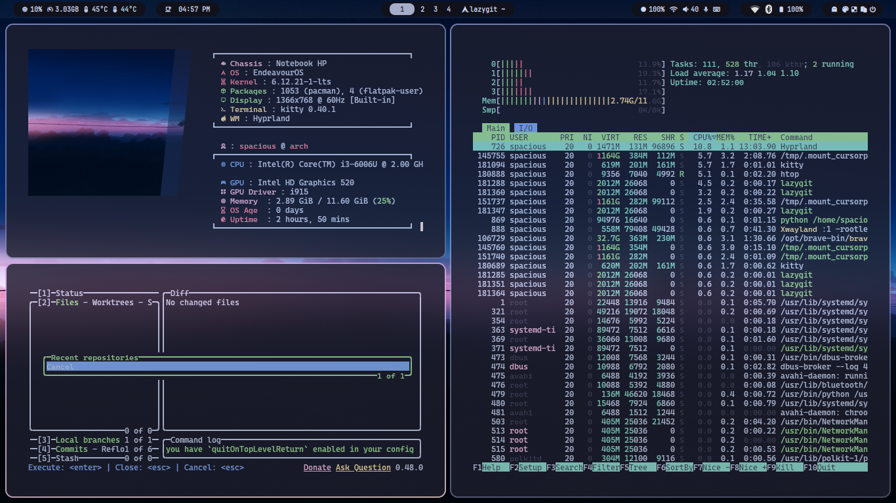

# Dotfiles

This repository contains my personal dotfiles for configuring my development environment on Linux.

## Overview

This collection includes configuration files for a modern, minimal desktop setup focused on productivity and aesthetics.



## Included Configurations

- **Hyprland** - A dynamic tiling Wayland compositor
- **Visual Studio Code** - Editor configuration and extensions
- **Spotify** - Custom theme and settings
- **Fastfetch/Neofetch** - System information display
- **Kitty** - Fast, feature-rich terminal emulator
- **Fish** - User-friendly shell with custom functions
- **Dunst** - Lightweight notification daemon
- **Rofi** - Application launcher and window switcher
- **Custom Menus** - Scripts for system control

## Installation

1. Clone this repository:
   ```bash
   git clone https://github.com/yourusername/dotfiles.git
   cd dotfiles
   ```

2. Run the installation script:
   ```bash
   ./install.sh
   ```

3. Log out and log back in to apply all changes.

## Customization

Feel free to modify any configuration files to suit your preferences. The modular structure makes it easy to adopt only the parts you want.

## Dependencies

- Wayland
- Git
- Basic build tools (make, gcc, etc.)

## License

MIT License - Feel free to use and modify as you wish.
